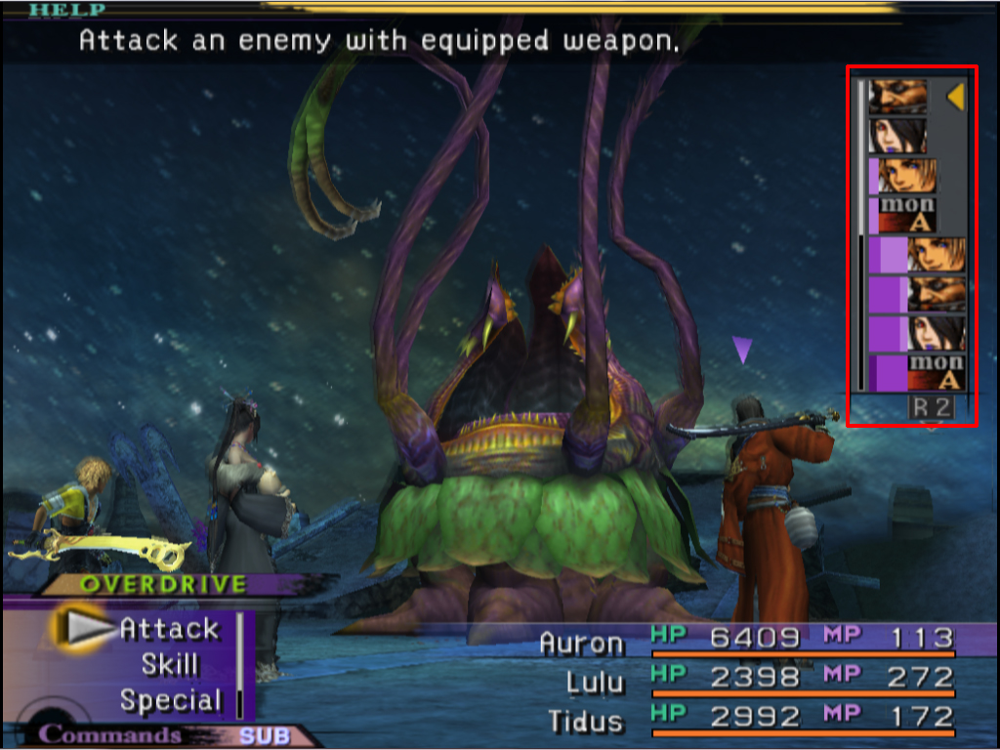

I recently saw this question posted in the [Help channel on bevy's discord](https://discordapp.com/channels/691052431525675048/1019697973933899910), this is something I've thought about implementing myself, as I have an idea for a turn based tactics rpg, so this seemed as good a time as any to take a crack at it, and detail my thoughts on the implementation in a blog post


## 1. What type of turns are we talkin?

the prompt of "turn-based game" is a bit more open ended than it first appears, a lot of questions here will help inform our implementation:

### What are we actually building?

<!-- Each character takes their turn one at a time, sequentially-->



```rust
    pub struct Turn;
```

